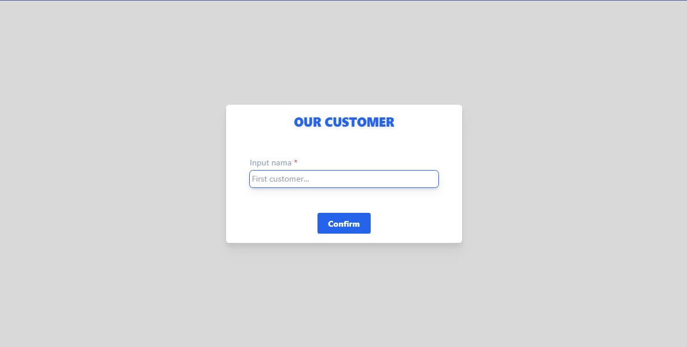
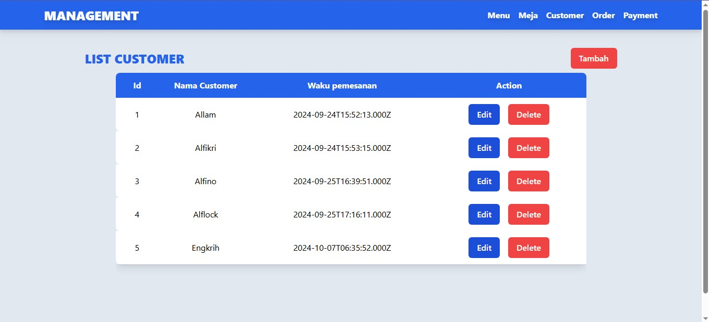
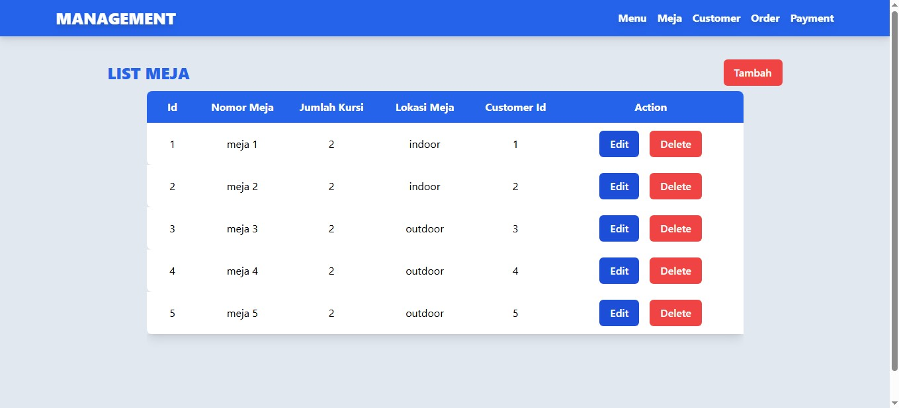
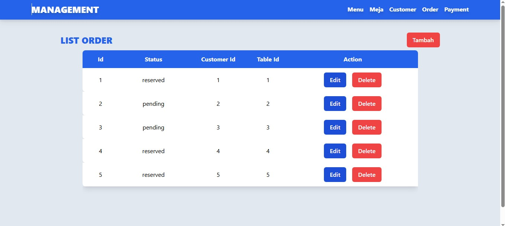
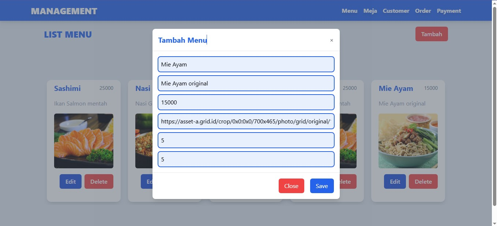
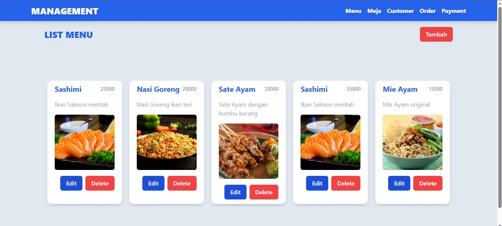
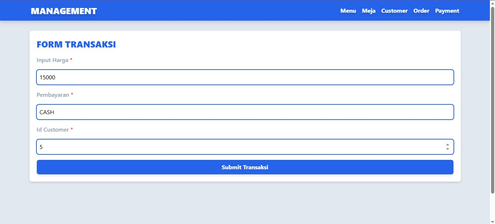
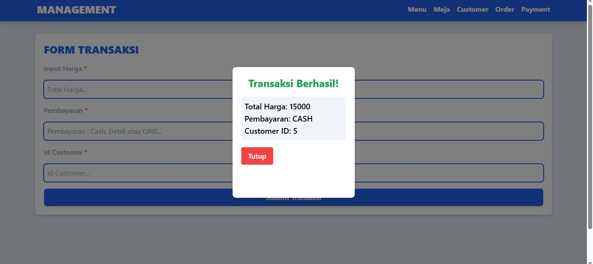

# PROJECT UTS FRONT END
Disini saya membuat sebuah project UTS Front End yaitu Management Order dengan menggunakan library React JS, EXPRESS JS, React Router DOM untuk melakukan routing, AXIOS untuk melakukan fetching data dan menggunakan Tailwind CSS untuk memberikan responsive pada tampilan web.

## FEATURES 
- Responsive design for mobile, tablet, dan desktop views.
- Integrasi dengan Rest API untuk fetching data.
- styled using <b>Tailwind CSS</b>

### YANG DIGUNAKAN DALAM PEMBUATAN PROJECT
- <b>React</b> - JavaScript library for building user interfaces.
- <b>Tailwind CSS</b> - A utility-first CSS framework.
- <b>Axios</b> - Promise-based HTTP client for API requests.
- <b>React Router DOM</b> - A library for routing in React applications, providing a way to navigate between different components or pages within a web application.

## ROUTING AKSES MENU :
- /menu
- /meja
- /customer
- /order
- /payment

## SCREENSHOT
Berikut hasil screenshot dari tampilan yang telah dibuat :

1. <b>Halaman Awal</b> - memasuki nama customer. https://ciessnaputraandika.github.io/UTS_CiessnaPutraAndika_FE/
2. <b>Halaman Table Customer</b> - data nama Customer. https://ciessnaputraandika.github.io/UTS_CiessnaPutraAndika_FE/customer
3. <b>Halaman Table Meja</b> - data meja Customer. https://ciessnaputraandika.github.io/UTS_CiessnaPutraAndika_FE/meja
4. <b>Halaman Table Order</b> - data Order Customer. https://ciessnaputraandika.github.io/UTS_CiessnaPutraAndika_FE/order
5. <b>Hasil Modal Menu</b> - memasuki data menu.
6. <b>Halaman Menu</b> - tampilan data menu. https://ciessnaputraandika.github.io/UTS_CiessnaPutraAndika_FE/menu
7. <b>Halaman Transaksi</b> - memasuki data transaksi. https://ciessnaputraandika.github.io/UTS_CiessnaPutraAndika_FE/payment
7. <b>Hasil Modal Transaksi</b> - hasil data transaksi

#### NOTE :
Setiap Create akan memunculkan Modal jika menekan button Tambah pada setiap menu halaman dan hasil dari semua input akan masuk kedalam database.

#### THANK YOU